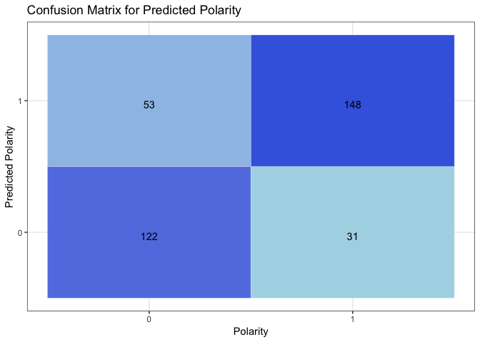

<!-- README.md is generated from README.Rmd. Please edit that file -->

# deepSentimentR

<!-- badges: start -->

[](https://www.repostatus.org/#active)
[](https://opensource.org/licenses/GPL-3.0)
[](https://travis-ci.org/adityamangal410/deepSentimentR)
[](https://codecov.io/github/adityamangal410/deepSentimentR?branch=master)
<!-- badges: end -->

The goal of deepSentimentR is to provide functionality to query, view
and analyze sentiment datasets.

## Installation

<!--
You can install the released version of deepSentimentR from [CRAN](https://CRAN.R-project.org) with:

``` r
install.packages("deepSentimentR")
```
-->

### Prerequisites

``` r
install.packages("dplyr")
install.packages("keras")
keras::install_keras()
```

### DeepSentimentR

You can install the development version from
[GitHub](https://github.com/) with:

``` r
# install.packages("devtools")
devtools::install_github("adityamangal410/deepSentimentR")
```

## Setup using Rocker

You can use [rocker](https://www.rocker-project.org/), which provides a
set of docker images with R and different flavours of tidyverse, ML,
geospatial
    etc.

### Setup using [rocker/ml](https://hub.docker.com/r/rocker/ml)

    docker run -d --name rstudio -p 8787:8787 -e PASSWORD=<PASSWORD> -e USER=<USER> -v /Users/<USER>/Desktop:/Desktop rocker/ml

Go to <http://localhost:8787> to login to the rstudio
server.

``` r
devtools::install_github("adityamangal410/deepSentimentR")
```

### Setup using [rocker/tidyverse](https://hub.docker.com/r/rocker/tidyverse)

Experimental
    steps

    docker run -d --name rstudio -p 8787:8787 -e PASSWORD=<PASSWORD> -e USER=<USER> -v /Users/<USER>/Desktop:/Desktop rocker/tidyverse

Go to <http://localhost:8787> to login to the rstudio server.

``` r
library(tidyverse)
system("python -V") # make sure you're using python3
#If Not, login to docker container and run following
#rm /usr/bin/python
#ln -s /usr/bin/python3 /usr/bin/python
#apt-get install curl
system("curl https://bootstrap.pypa.io/get-pip.py -o get-pip.py")
system("python get-pip.py")
system("pip3 install virtualenv")
install.packages("keras")
keras::install_keras()
devtools::install_github("adityamangal410/deepSentimentR")
```

## Example

Visualize polarity frequency based on given filters:

``` r
library(dplyr)
library(deepSentimentR)
data("sentiment140_train")
sentiment140_train %>% 
  freq_by_polarity(user_list = c("", "mcraddictal"), 
                   start_date_time = lubridate::as_datetime("2009-05-30"),
                   end_date_time = lubridate::as_datetime("2009-06-03"),
                   keyword_list = c(""))
#> $raw
#> # A tibble: 6 x 14
#>   polarity     id date                query user  text  nouns adjectives
#>   <chr>     <int> <dttm>              <chr> <chr> <chr> <int>      <int>
#> 1 Negative 1.99e9 2009-06-01 16:44:55 NO_Q… mcra… @oy_…     2          1
#> 2 Negative 1.99e9 2009-06-01 06:34:38 NO_Q… mcra… @hem…     3          2
#> 3 Positive 1.98e9 2009-05-31 17:31:47 NO_Q… mcra… nd I…     3          1
#> 4 Negative 1.98e9 2009-05-31 15:39:18 NO_Q… mcra… @CRs…     3          1
#> 5 Negative 1.97e9 2009-05-30 13:19:07 NO_Q… mcra… @oy_…     2          2
#> 6 Positive 1.98e9 2009-05-31 00:06:28 NO_Q… mcra… @sca…     5          1
#> # … with 6 more variables: prepositions <int>, articles <int>,
#> #   pronouns <int>, verbs <int>, adverbs <int>, interjections <int>
#> 
#> $frequency
#> # A tibble: 2 x 2
#>   polarity counts
#>   <fct>     <int>
#> 1 Negative      4
#> 2 Positive      2
#> 
#> $plot
```


Use pre-trained LSTM model using Glove Embeddings to make polarity
predictions for the sample test dataset:

``` r
predict_polarity_keras(model_load_path = system.file("extdata",
                                                     "train_glove_lstm.rds",
                                                     package = "deepSentimentR",
                                                     mustWork = TRUE))
#> $raw
#> # A tibble: 354 x 14
#>    polarity    id date                query user  text  nouns adjectives
#>    <chr>    <int> <dttm>              <chr> <chr> <chr> <int>      <int>
#>  1 Positive   217 2009-05-25 17:29:39 mcdo… Mami… mgg …     7          2
#>  2 Positive  2140 2009-05-20 02:38:17 nike  Chet… ew n…     4          2
#>  3 Negative   224 2009-05-25 17:34:51 chen… QCWo… ife?…     9          3
#>  4 Positive   569 2009-06-07 21:38:16 kind… rach… @lon…     8          2
#>  5 Positive  2546 2009-06-08 00:13:48 kind… k8tb… " lo…     7          1
#>  6 Positive  1019 2009-05-11 05:21:25 lebr… unde… atch…     3          1
#>  7 Negative  2110 2009-05-18 01:14:35 Malc… blin… @por…     7          3
#>  8 Positive   256 2009-05-27 23:59:18 goog… maex… " am…     3          1
#>  9 Negative   413 2009-06-02 03:17:04 time… Jaso… " ha…    11          4
#> 10 Positive  1003 2009-05-11 03:18:59 kind… Happ… y Ki…     1          0
#> # … with 344 more rows, and 6 more variables: prepositions <int>,
#> #   articles <int>, pronouns <int>, verbs <int>, adverbs <int>,
#> #   interjections <int>
#> 
#> $predictions
#> # A tibble: 354 x 15
#>    polarity    id date                query user  text  nouns adjectives
#>       <dbl> <int> <dttm>              <chr> <chr> <chr> <int>      <int>
#>  1        1   217 2009-05-25 17:29:39 mcdo… Mami… mgg …     7          2
#>  2        1  2140 2009-05-20 02:38:17 nike  Chet… ew n…     4          2
#>  3        0   224 2009-05-25 17:34:51 chen… QCWo… ife?…     9          3
#>  4        1   569 2009-06-07 21:38:16 kind… rach… @lon…     8          2
#>  5        1  2546 2009-06-08 00:13:48 kind… k8tb… " lo…     7          1
#>  6        1  1019 2009-05-11 05:21:25 lebr… unde… atch…     3          1
#>  7        0  2110 2009-05-18 01:14:35 Malc… blin… @por…     7          3
#>  8        1   256 2009-05-27 23:59:18 goog… maex… " am…     3          1
#>  9        0   413 2009-06-02 03:17:04 time… Jaso… " ha…    11          4
#> 10        1  1003 2009-05-11 03:18:59 kind… Happ… y Ki…     1          0
#> # … with 344 more rows, and 7 more variables: prepositions <int>,
#> #   articles <int>, pronouns <int>, verbs <int>, adverbs <int>,
#> #   interjections <int>, pred_polarity[,1] <int>
#> 
#> $confusion_matrix
#> # A tibble: 4 x 3
#>   polarity pred_polarity count
#>   <fct>    <fct>         <int>
#> 1 0        0               122
#> 2 0        1                53
#> 3 1        0                31
#> 4 1        1               148
#> 
#> $true_negative
#> [1] 122
#> 
#> $true_positive
#> [1] 148
#> 
#> $false_positive
#> [1] 53
#> 
#> $false_negative
#> [1] 31
#> 
#> $precision
#> [1] 0.7363184
#> 
#> $recall
#> [1] 0.8268156
#> 
#> $f1
#> [1] 0.7789474
#> 
#> $accuracy
#> [1] 0.7627119
#> 
#> $plot
```



Check out full reference and examples at -
<https://adityamangal410.github.io/deepSentimentR/>
