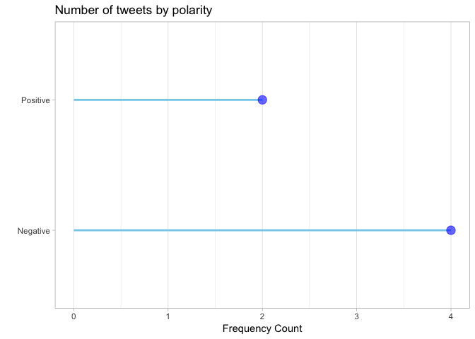

<!-- README.md is generated from README.Rmd. Please edit that file -->

# deepSentimentR

<!-- badges: start -->

[](https://www.repostatus.org/#wip)
[](https://opensource.org/licenses/GPL-3.0)
[](https://travis-ci.org/adityamangal410/deepSentimentR)
[](https://codecov.io/github/adityamangal410/deepSentimentR?branch=master)
<!-- badges: end -->

The goal of deepSentimentR is to provide functionality to query, view
and analyze sentiment datasets.

<https://adityamangal410.github.io/deepSentimentR/>

## Installation

<!--
You can install the released version of deepSentimentR from [CRAN](https://CRAN.R-project.org) with:

``` r
install.packages("deepSentimentR")
```
-->

And the development version from [GitHub](https://github.com/) with:

``` r
# install.packages("devtools")
devtools::install_github("adityamangal410/deepSentimentR")
```

## Example

This is a basic example which shows you how to solve a common problem:

``` r
library(dplyr)
library(deepSentimentR)
## basic example code
data("sentiment140_train")
sentiment140_train %>% 
  freq_by_polarity(user_list = c("", "mcraddictal"), 
                   start_date_time = lubridate::as_datetime("2009-05-30"),
                   end_date_time = lubridate::as_datetime("2009-06-03"),
                   keyword_list = c(""))
#> $raw
#> # A tibble: 6 x 14
#>   polarity     id date                query user  text  nouns adjectives
#>      <int>  <int> <dttm>              <chr> <chr> <chr> <int>      <int>
#> 1        0 1.99e9 2009-06-01 16:44:55 NO_Q… mcra… @oy_…     2          1
#> 2        0 1.99e9 2009-06-01 06:34:38 NO_Q… mcra… @hem…     3          2
#> 3        4 1.98e9 2009-05-31 17:31:47 NO_Q… mcra… nd I…     3          1
#> 4        0 1.98e9 2009-05-31 15:39:18 NO_Q… mcra… @CRs…     3          1
#> 5        0 1.97e9 2009-05-30 13:19:07 NO_Q… mcra… @oy_…     2          2
#> 6        4 1.98e9 2009-05-31 00:06:28 NO_Q… mcra… @sca…     5          1
#> # … with 6 more variables: prepositions <int>, articles <int>,
#> #   pronouns <int>, verbs <int>, adverbs <int>, interjections <int>
#> 
#> $frequency
#> # A tibble: 2 x 2
#>   polarity counts
#>   <fct>     <int>
#> 1 0             4
#> 2 4             2
#> 
#> $plot
```


